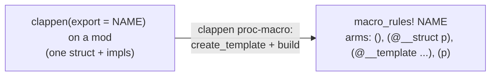
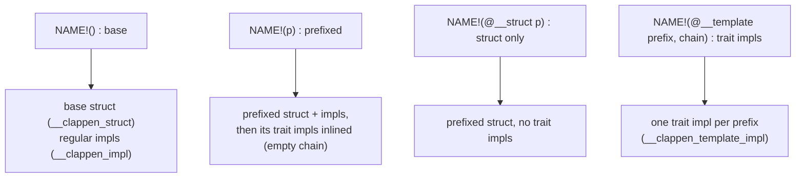
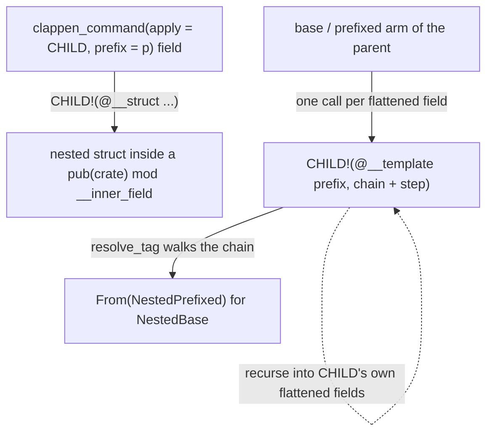

# How clappen works

`#[clappen]` does not expand to code directly. Applied to a `mod`, it generates a
`macro_rules! NAME`, and you invoke that macro (`NAME!()`, `NAME!("primary")`, ...) to generate a
prefixed copy of the struct and its impls. Three hidden proc-macros do the per-item work:
`__clappen_struct`, `__clappen_impl`, `__clappen_template_impl`.

## 1. Generation: one macro per mod



## 2. The macro arms

Each `NAME!` invocation matches one arm:



`@__struct` is the struct-only arm used for nested fields. `(p)` inlines its own trait impls and
the recursion into flattened fields (the same body as `@__template` with an empty chain), rather
than self-calling `@__template`: a `#[macro_export]` macro built by a proc-macro can't name itself
across crates (a bare self-call resolves at the caller's scope, and `$crate::` is denied for such
macros). `@__template` remains the arm a parent calls when it recurses into this struct as a
flattened field.

## 3. Nesting and the chain

`#[clappen_command(apply = CHILD, prefix = p)]` on a field generates the nested struct by calling
the child macro, and the same field drives the trait-impl recursion:



The **chain** is the path data passed through `@__template` calls: one `ChainStep`
`(command_prefix, field, parent_default)` per flatten level, accumulated from the outermost struct
down. `resolve_tag` walks it to compute the nested type's module path and field prefix, so
`Prefixed` resolves to e.g. `__inner_nested::Test1Nested2`. An empty chain is a top-level
instantiation; a non-empty chain is a nested one. The macros are defined once per `mod`; nesting
is those macros calling each other, with the chain carrying the current position.

## 4. End-to-end walkthrough

A leaf struct with a template, and a parent that flattens it and also has a template:

```rust
#[clappen::clappen(export = endpoint)]
mod endpoint {
    pub struct Endpoint { pub url: String }
    #[clappen_template_impl]
    impl From<Prefixed> for Base {
        fn from(v: Prefixed) -> Self { Self { url: v.url } }
    }
}

#[clappen::clappen(export = server)]
mod server {
    pub struct Server {
        pub name: String,
        #[clappen_command(apply = endpoint, prefix = "api")]
        pub backend: Endpoint,
    }
    #[clappen_template_impl]
    impl From<Prefixed> for Base {
        fn from(v: Prefixed) -> Self { Self { name: v.name, backend: v.backend.into() } }
    }
}
```

**Step 1: `#[clappen]` builds one macro per mod.** No code is emitted yet. The `clappen` proc-macro
turns each mod into a `macro_rules!`; for `server`, sketched:

```rust
macro_rules! server {
    () => { /* base struct */ };
    ($prefix: literal) => { /* prefixed struct, then self_apply + child_apply */ };
    (@__struct $prefix: literal) => { /* prefixed struct only */ };
    (@__template $prefix: literal, chain = [ .. ]) => { /* self_apply + child_apply */ };
}
```

**Step 2: `server!()` (base).** Matches `()`. The `backend` field's `__inner_*` module is filled by
`server`'s macro calling `endpoint!(@__struct "api")`. `server` has its own template, so
`base_child_apply` is empty:

```rust
pub(crate) mod __inner_backend {
    pub struct ApiEndpoint { pub api_url: String }
}
pub struct Server {
    pub name: String,
    pub backend: __inner_backend::ApiEndpoint,
}
```

**Step 3: `server!("test1")` (prefixed).** Matches `($prefix)` with `$prefix = "test1"`, and emits
three things:

1. the prefixed struct (its nested module filled by `endpoint!(@__struct ...)`):

   ```rust
   pub(crate) mod __inner_test1_backend {
       pub struct Test1ApiEndpoint { pub test1_api_url: String }
   }
   pub struct Test1Server {
       pub test1_name: String,
       pub test1_backend: __inner_test1_backend::Test1ApiEndpoint,
   }
   ```

2. `self_apply`, the tagged impl
   `#[clappen::__clappen_template_impl(prefix = "test1", chain = [], ...)] impl From<Prefixed> for Base`;

3. `child_apply`, the call `endpoint!(@__template "test1", chain = [("api", backend, "")])`.

**Step 4: `child_apply` recurses into `endpoint`.** That call enters `endpoint`'s `@__template` arm,
which emits `endpoint`'s own `self_apply` at the chain it was handed:
`#[clappen::__clappen_template_impl(prefix = "test1", chain = [("api", backend, "")], ...)] impl From<Prefixed> for Base`.
`endpoint` has no flattened fields, so there is no further `child_apply`.

**Step 5: the proc-macros rewrite the tagged impls.** `__clappen_template_impl` replaces the
`Prefixed`/`Base` tags with concrete types (via `resolve_tag` walking the chain) and prefixes the
field accesses:

- `server`'s impl has an empty chain, so `Prefixed = Test1Server`, `Base = Server`.
- `endpoint`'s impl has chain `[("api", backend, "")]`, which locates the nested types, so
  `Prefixed = __inner_test1_backend::Test1ApiEndpoint`, `Base = __inner_backend::ApiEndpoint`.

**Result.** `server!("test1")` has produced these two conversions:

```rust
impl From<Test1Server> for Server {
    fn from(value: Test1Server) -> Self {
        Self { name: value.test1_name, backend: value.test1_backend.into() }
    }
}
impl From<__inner_test1_backend::Test1ApiEndpoint> for __inner_backend::ApiEndpoint {
    fn from(value: __inner_test1_backend::Test1ApiEndpoint) -> Self {
        Self { api_url: value.test1_api_url }
    }
}
```

The parent's `backend.into()` compiles because the second impl is exactly the conversion it needs.

## 5. Two kinds of generated code: `self_apply` and `child_apply`

Everything the template feature emits is one of two things:

- **`self_apply`**, this struct's own trait impl, emitted as a tagged impl and rewritten later by
  the proc-macro:

  ```rust
  #[clappen::__clappen_template_impl(prefix = $prefix, ..., chain = [ .. ], ...)]
  impl From<Prefixed> for Base { .. }
  ```

  This is the same pattern as `#[__clappen_impl]` on a regular impl: emit the impl with a proc-macro
  attribute, let the proc-macro rewrite it. No macro recursion is involved.

- **`child_apply`**, a call into a flattened child's macro, `CHILD!(@__template prefix, chain + step)`,
  which makes the child emit its own `self_apply`. In the walkthrough above,
  `impl From<Test1Server> for Server` is `self_apply`; the `endpoint!(@__template ...)` call is
  `child_apply`.

The `@__template` arm, the recursion, and the chain exist only for `child_apply`. Regular impls
never need them; template impls sometimes do:

- A regular impl only touches `self.field`; `__clappen_impl` rewrites that access locally, nothing
  else has to exist.
- A template conversion can do `Self { backend: value.backend.into() }`. For that `.into()` to
  compile, `From<Test1ApiEndpoint> for ApiEndpoint` (the child's conversion) must already exist, and
  only `endpoint`'s own macro can generate it: the parent's proc-macro does not have `endpoint`'s
  struct or its template. So the parent calls the child's macro, and the chain is the position info
  the child needs to resolve its own nested types.

Which arm emits which:

| arm | `self_apply` | `child_apply` |
|---|---|---|
| `()` base | - | yes, only when this struct has no template of its own |
| `($prefix)` prefixed | yes | yes |
| `(@__template ...)` (this struct flattened in a parent) | yes | yes |

`base` has no `self_apply`: the base is unprefixed, so there is no `From<Prefixed>` for it.

## The helper proc-macros

- `__clappen_struct`: rewrites the struct, applies the field/struct prefix, and for each
  `clappen_command` field emits the `__inner_*` module that calls the child macro.
- `__clappen_impl`: applies the prefix to an impl block's field accesses.
- `__clappen_template_impl`: specializes one `#[clappen_template_impl]` block, replacing the
  `Base`/`Prefixed` tags with the concrete types resolved from the chain.
